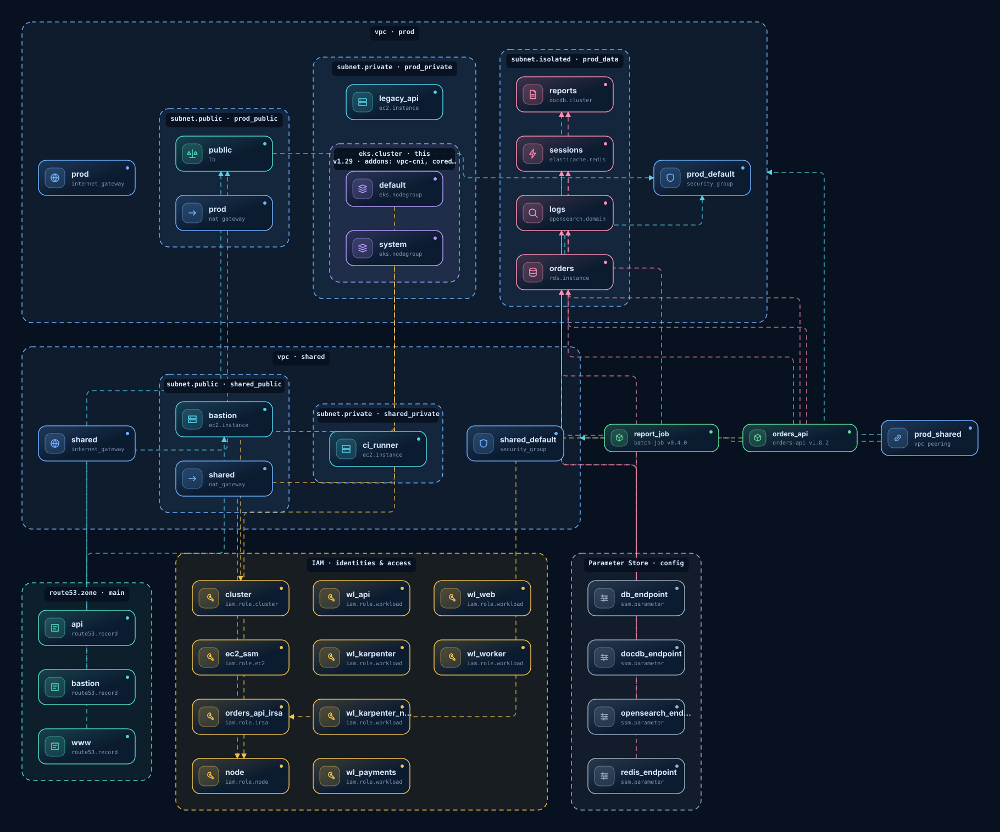
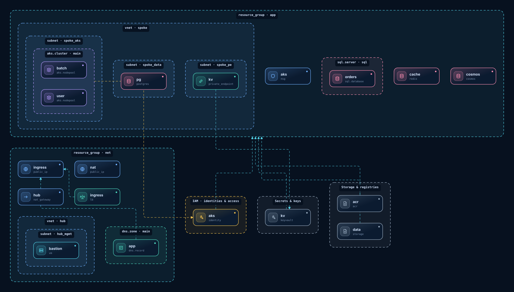
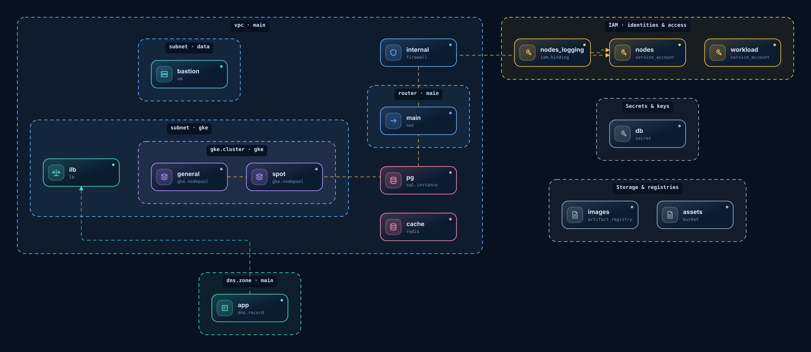
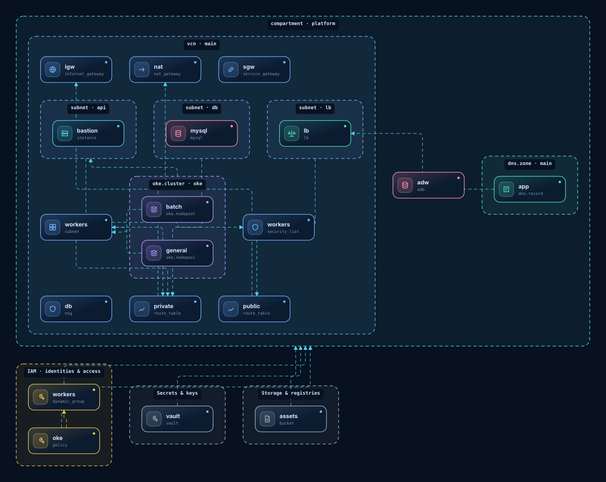
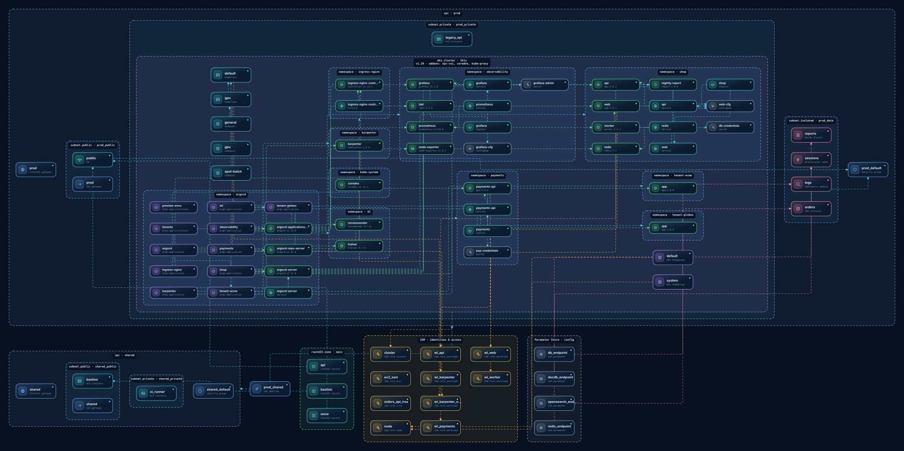

# infra-diagram

Architecture diagrams **derived from your real Terraform and Kubernetes source**, not from a description.
Offline (`terraform graph` + HCL attribute extraction), no cloud credentials, nothing written into your repos.
Whatever cannot be resolved from the source is **reported, never guessed**.

AWS · Azure · GCP · OCI · Kubernetes (Karpenter, ArgoCD) · one environment per `tfvars` · multi-repo.



| | |
|---|---|
|  |  |
|  |  |

*Gallery images are generated from the synthetic samples in `examples/` (invented values).*

## Outputs

| Output | Command | Notes |
|---|---|---|
| **Single-file HTML** | `npm run export:html -- --out diagram.html` | Offline, no external requests; environment selector, 4 styles × light/dark, pan/zoom, details panel, SVG download, vector PDF via print. Generated in milliseconds, no browser or Terraform needed. |
| **Vector SVG** | `npm run export:svg -- --env platform_prod --out-dir out/` | Rects, paths and text only (no raster). Also the **SVG** button of the viewer. |
| Interactive viewer | `viewer/` (GitHub Pages) | Drill-down (expand/collapse), PNG / PDF / SVG export. |

Both exports accept `--env <id>` (repeatable), `--preset blueprint|draft|neon|soft`, `--theme light|dark`, or `--graph <compiled.json> --catalog <catalog.json>` for your own compiled graph.

## How it works

Extract (`terraform graph`, offline) → resolve HCL attributes per tfvars → manifest (type → kind) → compile (containment from references and the per-provider catalog) → render.
Details in [SKILL.md](SKILL.md).

## Develop

```bash
npm test                 # node:test; 2 tests need the terraform binary
npm run build:samples    # regenerate viewer/data from examples/
```

## License

[MIT](LICENSE)
